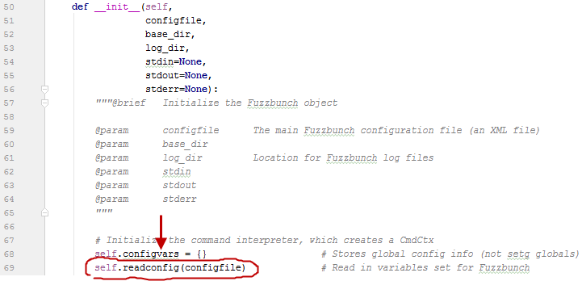
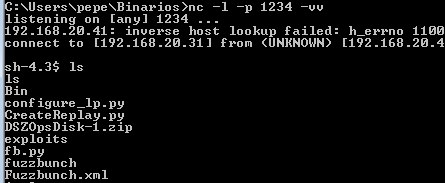
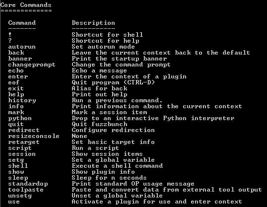
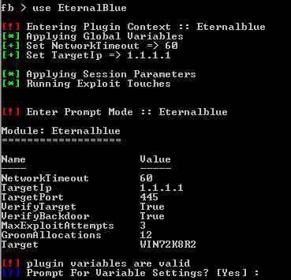
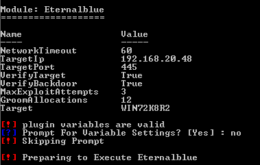
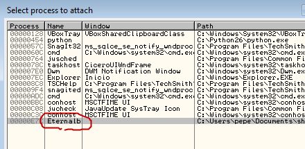
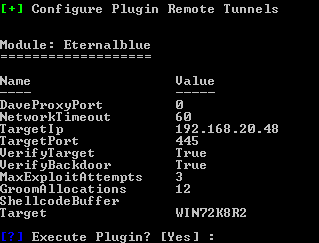
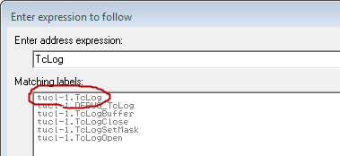
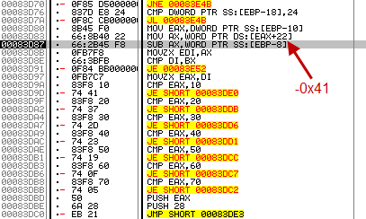

# shedding light on shadow brokers

### Analizando fuzzbunch

DoublePulsar y EternalBlue son las herramientas que todos ejecutaron ya, es por eso que para variar vamos a mirar como esta codeado el framework en python y ver si le podemos sacar algun partido

tambien vamos a cargar el eternalblue pero debuggeandolo para ver que es lo que hace y no fiarnos solo en los prints

el vector que vamos a usar para analizar el python, es mirar el codigo y cuando no nos cierra algo, le agregamos un:

```python
import pdb;pdb.set_trace()
```

para breakear la ejecucion y stepear desde ahi

pongamos uno de prueba para comenzar el traceo, luego al ejecutarlo breakea automaticamente


en la anterior imagen setea todas las variables de los directorios que va a usar posteriormente

FB_DIR apunta al directorio base de fuzzbunch y desde ahi accede a los plugins, payloads, etc...

en la siguiente imagen muestro los directorios de plugins que no estan en el leak


tal vez haya que esperar a un nuevo leak por parte de shadow brokers

despues llegamos al __main__, donde llama a la intuitiva setup_and_run:


este metodo crea una instancia del objeto Fuzzbunch, veamos el constructor del objeto:



configfile es FB_CONFIG con el valor:

```python
os.path.join(FB_DIR, "Fuzzbunch.xml")
```

readconfig parsea ese archivo xml y carga la informacion en el hash configvars, el cual almacena las opciones globales.

Ni bien retorna ese metodo setea la variable enablecolor evaluando el dato del xml


### Bug en archivo de configuracion

encontramos un bug de seguridad en fuzzbunch, claramente el impacto es minimo porque el xml ya viene con el framework.

El archivo original tiene un texto con un True o False booleano de python:


como este texto es evaluado con eval(), podriamos lograr una ejecucion de comandos con:


dejando la variable enablecolor con el stdout del dir:



la ejecucion de comandos corrio satisfactoriamente, y ese comando va a correr con los privilegios del usuario que ejecuto fuzzbunch

### Siguiendo en el constructor de Fuzzbunch

Fuzzbunch es heredado de FbCmd y como es logico en el constructor crea el padre:


FbCmd hereda de cmd.Cmd, ese objeto abuelo es parte de la libreria estandar de python y se usa para configurar una interfaz interactiva al estilo metasploit o gdb

### Comandos interactivos

antes de cmd.Cmd para hacer una consola interactiva uno codeaba:

```python
while True
    command = raw_input("prompt> ")
    if command == "fruta"
        print "Ejecutando fruta"
    else if command == "note"
        print "note running"
```

ahora con cmd.Cmd podemos lograr el mismo efecto con un codigo mas limpio:

```python
import cmd

class HelloWorld(cmd.Cmd):
    
    def do_fruta(self, line):
        print "Ejecutando fruta"
    
    def do_note(self, line):
        print "note running"

if __name__ == '__main__':
    HelloWorld().cmdloop()
```
con eso en mente solo tenemos que ver el metodo do_something donde something es el comando

los comandos disponibles son:



el comando "use" nos deja cargar los plugins, entonces le vamos a dedicar un capitulo

### command "use"

vamos a cargar eternalblue para analizar como cargan los plugins:



"use" parcea el archivo xml del plugin para cargar los parametros que estan entre el tag \<inputparameters\>

para solicitar un option del plugin se configura asi:


y si queremos dar opciones para elegir usamos paramchoice:


estas opciones son para configurar TargetPort, Shellcode y diferentes opciones que necesita el exploit

### Run y Attach al ejecutable

una vez finalizada la carga de options del plugin pasa a ejecutar el exe con Popen y seteando un par de argumentos


para analizar el ejecutable vamos a ponerle un while true en el entry point y partimos desde ahi


esto nos va a permitir hacer un Attach al process y debuggearlo antes de que ejecute su codigo

reiniciamos el fuzzbunch y cargamos el EternalBlue, va a quedar parado en:



nos attacheamos al proceso:



esta no es el popen anterior que ya analizamos, para saber los argumentos que recibio el programa nos vamos al PEB


y desde ahi a ProcessParameters


fue llamado con la opcion --ValidateOnly

restoreamos los bytes originales del EntryPoint y lo corremos, terminando el proceso


ahora si nos disponemos a debuggear la parte del exploit mientras se ejecuta:



attacheamos y restoreamos los bytes para tracear el ejecutable, pero lamentablemente cuando miremos fuzzbunch vamos a tener esta ventana:


### Buscando el timeout

Con un grep rapido a la string "Timeout" sale rapido la zona:


por default esta seteado a 45:


le ponemos una cantidad de segundos que nos permita trabajar tranquilos, en mi caso 3600

### Cayendo en zonas calientes del exploit

el exploit printea un monton de strings mientras va ejecutando, esos prints provienen de TcLog, lo buscamos y ponemos un breakpoint ahi:



donde triggerea el breakpoint caemos en calls lindos como:


el exploit revienta smb, asi que buscamos en las importadas para encontrar funciones de manejo de red


muchos mensajes smb se pasan por los sockets, como:


### Pinging backdoor

el pinging backdoor es un mensaje que envia el exploit a la maquina para ver si ya esta comprometida y con el agente instalado. Vamos a interceptar este mensaje:

para hacer eso breakeamos en la cuarta llamada a recv y verificamos como lleno el buffer:


ponemos un hardware breakpoint on access para caer cuando trabaja con ese byte en particular y se nos dispara aqui:



el codigo anterior salio de una especie de switch, y chequea varias posibilidades

como por ejemplo 0x51 que es que la maquina esta comprometida:


o 0x81 y 0x71 que son codigos de error:


### tarea para la casa

Con esta consulta SMB podemos saber facilmente si una maquina esta comprometida con el agente instalado, ahora tocara:

* hacer un plugin de nmap que escanee
* un disector de wireshark para el protocolo de comunicacion del cover channel

